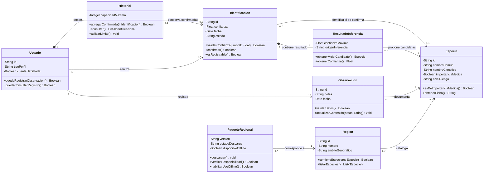

# Diagrama de clases UML — BIOMA

```mermaid
classDiagram
    direction LR
    class Usuario {
        -String id
        -String tipoPerfil
        -Boolean cuentaHabilitada
        +puedeRegistrarObservacion() Boolean
        +puedeConsultarRegistro() Boolean
    }
    class Especie {
        -String id
        -String nombreComun
        -String nombreCientifico
        -Boolean importanciaMedica
        -String nivelRiesgo
        +esDeImportanciaMedica() Boolean
        +obtenerFicha() String
    }
    class Identificacion {
        -String id
        -Float confianza
        -Date fecha
        -String estado
        +validarConfianza(umbral: Float) Boolean
        +confirmar() Boolean
        +esRegistrable() Boolean
    }
    class Historial {
        -Integer capacidadMaxima
        +agregarConfirmada(i: Identificacion) Boolean
        +consultar() List~Identificacion~
        +aplicarLimite() void
    }
    class Observacion {
        -String id
        -String notas
        -Date fecha
        +validarDatos() Boolean
        +actualizarContenido(notas: String) void
    }
    class Region {
        -String id
        -String nombre
        -String ambitoGeografico
        +contieneEspecie(e: Especie) Boolean
        +listarEspecies() List~Especie~
    }
    class PaqueteRegional {
        -String version
        -String estadoDescarga
        -Boolean disponibleOffline
        +descargar() void
        +verificarDisponibilidad() Boolean
        +habilitarUsoOffline() Boolean
    }
    class ResultadoInferencia {
        -Float confianzaMaxima
        -String origenInferencia
        +obtenerMejorCandidato() Especie
        +obtenerConfianza() Float
    }

    Usuario "1" *-- "1" Historial : posee
    Historial "0..1" --> "0..50" Identificacion : conserva confirmadas
    Usuario "1" --> "0..*" Identificacion : realiza
    Usuario "1" --> "0..*" Observacion : registra
    Identificacion "0..*" --> "0..1" Especie : identifica si se confirma
    Identificacion "1" *-- "1" ResultadoInferencia : contiene resultado
    ResultadoInferencia "0..*" --> "1..*" Especie : propone candidatas
    Observacion "0..*" --> "1" Especie : documenta
    Region "0..*" --> "0..*" Especie : cataloga
    PaqueteRegional "0..*" --> "1" Region : corresponde a
```
